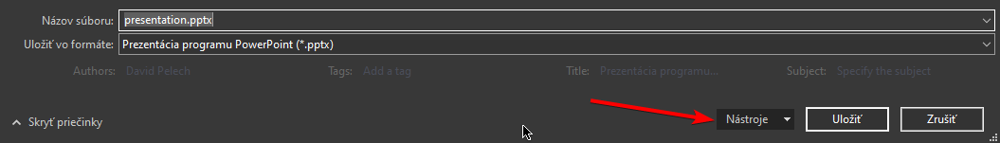
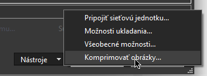
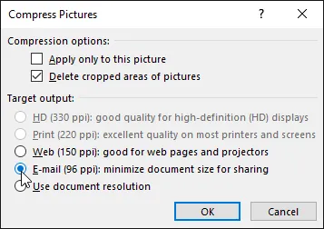
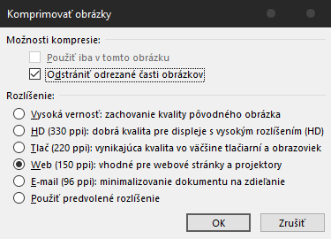

# Compress images in powerpoint

If you have a powerpoint presentation which is large due to the images being high quality or uncompressed, you can compress the images inside of the presentation straight from powerpoint. I'll be using PowerPoint 2016 Student Lifetime edition, but it should work similarly in other versions as well.

1. Open your presentation in PowerPoint
2. `File` > `Save As` > Pick a location
3. In the file saving dialog, locate the `Tools` dropdown in the bottom right, and select `Compress images` (apologies for foreign screenshot):
  
  
4. You should see this dialog:

5. Pick `Web` or `E-Mail` depending on your needs.
6. Pick a new filename and save it.
7. If needed, you can try exporting both E-mail and Web versions, and switch them according to your needs.

## Kompresia obrázkov v programe PowerPoint

Ak máte prezentáciu v programe PowerPoint, ktorá je veľká z dôvodu vysokej kvality alebo nekomprimovaných obrázkov, môžete obrázky v prezentácii komprimovať priamo z programu PowerPoint. Budem používať PowerPoint 2016 Student Lifetime edition, ale podobne by to malo fungovať aj v iných verziách.

1. Otvorte prezentáciu v aplikácii PowerPoint
2. `Súbor` > `Uložiť ako` > Vyberte umiestnenie
3. V dialógovom okne pre uloženie súboru vyhľadajte v pravom dolnom rohu rozbaľovaciu ponuku `Nástroje` a vyberte možnosť `Komprimovať obrázky`:
  
  
1. Malo by sa zobraziť toto dialógové okno:

1. Vyberte možnosť `Web` alebo `E-Mail` v závislosti od vašich potrieb.
2. Vyberte nový názov súboru a uložte ho.
3. V prípade potreby môžete vyskúšať exportovať `E-Mail` aj `Web` verziu a prepnúť ich