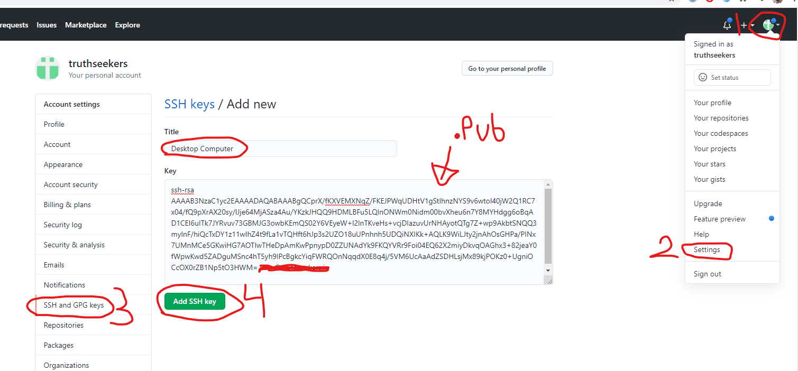
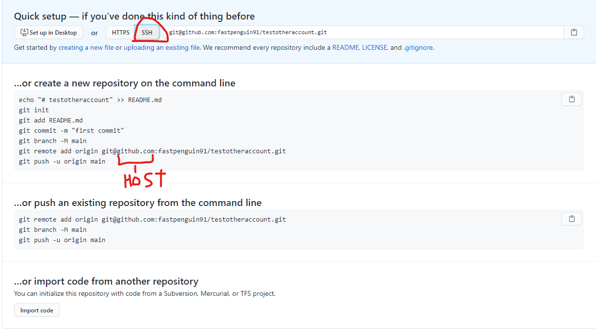

# multiple git accounts on windows with ssh
- see video: https://www.youtube.com/watch?v=ap56ivm0dhw
- this is from web-archive url of https://truthseekers.io/multiple-github-accounts-on-one-computer/
  - I edited the article and added more info
  
<iframe src="https://www.youtube-nocookie.com/embed/ap56ivm0dhw?rel=0&amp;autoplay=0&amp;showinfo=0&amp;enablejsapi=0" frameborder="0" loading="lazy" gesture="media" allow="autoplay; fullscreen" allowautoplay="true" allowfullscreen="true" width="728" height="409"></iframe>

In this tutorial we’re going to setup multiple GitHub accounts on the same computer with SSH. 
This is useful if you have a work account and a personal account, or any other time you have multiple GitHub accounts that you’re using on the same machine.

Assuming you don’t have ANY ssh keys setup for git, the steps are the following:

1.  Create SSH key (id\_rsa is standard name)
2.  Add SSH key to primary GitHub account
3.  Add SSH key to SSH-Agent
4.  Create secondary SSH key (id\_rsa\_other\_account)
5.  Add secondary SSH key to other GitHub account
6.  Add secondary SSH key to SSH-Agent
7.  Add both keys to a “config” file located in the .ssh/ folder
8.  Change Git repository user & email
9.  Test!

If you already have an SSH key (id\_rsa) and it’s added to SSH-Agent, then you can just skip the first 3 steps. That looks like a lot of steps but they’re pretty simple to follow along with. Let’s begin.

## Create SSH Key

Run the command `$ ssh-keygen -t rsa -C "youremail@email.com"` to create your SSH key. **\-t** is the “type” flag, which we set to **rsa**, and **\-C** is for comment. See [OpenBSD manual](https://web.archive.org/web/20220121175806/http://man.openbsd.org/cgi-bin/man.cgi/OpenBSD-current/man1/ssh-keygen.1?query=ssh-keygen&sec=1).

You’ll get something like this:

```
Generating public/private rsa key pair.
Enter file in which to save the key (/Users/john/.ssh/id_rsa):     #### This is *Nix flavored machines
Enter file in which to save the key (C:\Users\John/.ssh/id_rsa):   #### Poor souls on Windows
```

Note: If you already have an id\_rsa and id\_rsa.pub file, note that this command will overwrite the existing id\_rsa files and will mess up anything currently using that key. See below when we create our second SSH key.

**I left the passphrase empty** when prompted for one. You can also generate a new passphrase (5 words) in your password manager and use that.

Now check to make sure you have an id\_rsa and id\_rsa.pub file in your \\Users\\youruser\\.ssh\\ directory. If so, you’re ready to add the public key to GitHub

## Add SSH Key to GitHub

Login to your main GitHub account. If you go into your \\Users\\youruser\\.ssh\\ folder you can copy the entire contents of the id\_rsa.pub file and paste it into the key field as seen below. The title can be used to describe the machine. Something like “Desktop Computer home” or “Office space 27 xyz co” would be good.



## Add SSH Key to SSH-Agent

An SSH-Agent is something the client (your computer) uses to “sign” a message that gets forwarded back to the server. The server looks at the signature from the SSH-Agent and sees if it matches the private key. You can read more about [SSH-Agent here](https://smallstep.com/blog/ssh-agent-explained/).

run `$ ssh-add \path\to/.ssh/id_rsa` in your terminal. If you have problems, you may need to setup your ssh-agent. I don’t think there’s problems on \*Nix machines, but Windows users can see the below troubleshooting steps if you run into issues. Your mileage may vary.

### Windows TroubleShooting:

#### Enabling OpenSSH Client
Windows users may need to verify ssh-add actually works and an ssh-agent is installed. Here’s a [stackoverflow post that helped me](https://stackoverflow.com/questions/18683092/how-to-run-ssh-add-on-windows). (See tamj0rd2’s answer and the 2019 solution)

Make sure OpenSSH is installed and started

1.  Start Menu
2.  Search “Manage optional features”
3.  Make sure “Open SSH Client” is in the list. If not, figure out how to add it.
4.  Open “Services” from start menu
5.  Scroll down to “OpenSSH Authentication Agent” and right-click “properties”.
6.  Change startup type from “disabled” to **“Automatic (Delayed Start)”** so the SSH-Agent is turned on automatically after booting.
7.  Click the `Start` button to start the service

At this point **you may want to test this ssh key works** by creating a remote repository and pushing a commit from your local computer. I’ll save that until the end to save time.

#### Setting permissions for id_rsa file
You may see this message:
```
@@@@@@@@@@@@@@@@@@@@@@@@@@@@@@@@@@@@@@@@@@@@@@@@@@@@@@@@@@@
@         WARNING: UNPROTECTED PRIVATE KEY FILE!          @
@@@@@@@@@@@@@@@@@@@@@@@@@@@@@@@@@@@@@@@@@@@@@@@@@@@@@@@@@@@
Permissions for 'id_rsa' are too open.
It is required that your private key files are NOT accessible by others.
This private key will be ignored.
```

In that case, do the following:
- You locate the file in Windows Explorer, right-click on it then select "Properties".  
- Navigate to the "Security" tab and click "Advanced".
- Click `Disable Inheritance` and `Convert inherited premissions into explicit permissions on this object`
- Delete all permisions except for your account you are currently using
- On the top, if `Owner: ` is not your account, change it to your account.
- Then grant yourself "Full control"
- Hit `Apply` and `Save`
  
source and more info: [SuperUser](https://superuser.com/questions/1296024/windows-ssh-permissions-for-private-key-are-too-open)

## Rinse & Repeat for Steps 4, 5, 6

Now do the same thing for your other id\_rsa key with your other email, but **add an identifier at the end of the key**! Make sure you add the filename including the path to your .ssh/ folder.

```
$ ssh-keygen -t rsa -C "yourOTHERemail@email.com"    ## you'll receive terminal output

Enter file in which to save the key (C:\Users\John\.ssh/id_rsa): C:\Users\John/.ssh/id_rsa_other_account
```

Now **go check in .ssh/** and you should see the id\_rsa\_other\_account and id\_rsa\_other\_account.pub files AND the original id\_rsa and id\_rsa.pub files.

Add the id\_rsa\_other\_account to your OTHER GitHub account’s SSH keys like we did above. (see Github screenshot)

Now add the second SSH key into the SSH-Agent with:

`$ ssh-add \path\to\.ssh\id_rsa_other_account`

## Create SSH config file

Create the config file located in .ssh/ It doesn’t exist by default so you’ll have to create it. **/Users/John/.ssh/config** (no extension on config)

```
# Main account
Host github.com
   HostName github.com
   User git
   IdentityFile ~/.ssh/id_rsa

# Alt
Host github-alt
   HostName github.com
   User git
   IdentityFile ~/.ssh/id_rsa_other
```

## Test your multiple GitHub account setup!

We’re only going to bother with the “other” account, since you’ve most likely been using the one-account setup for a while and already know that part.

### Create a GitHub repository and get to the “instructions” for setting up the repo locally.



Now you’ll need to replace the “host” portion of the remote add origin string with the “Host” from the config file. If you look at the previous part of the post, you’ll see that the .ssh/id\_rsa\_other\_account is attached to the `Host github-other` and the `id_rsa_other_account.pub` goes to my secondary GitHub account. If I want to push to that GitHub account I need to run the git remote add command like this:

```
git remote add origin git@github-other:fastpenguin91/testotheraccount.git
```

After this, commit like normal, assuming you have a change to commit:

```
git add .
git commit -m "testing 2nd acct"
git push origin master
```


Now the only thing you have to do on each repository is set the user/email you’d like to use on that repo.

```
git config user.name "John C"
git config user.email "other@email.com"
```

That’s it!

## Updating an existing repository to use SSH
```
git remote set-url origin git@github.com:username/repo.git
```