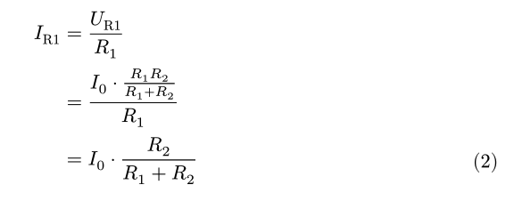
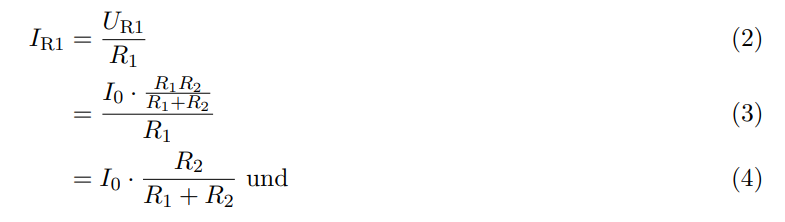

# Numbering equations with line breaks

I encountered this problem while trying to write some equations in Typst:

I had this piece of code that I expected would number every equation in an equation block with line breaks:

```
#set math.equation(
  numbering: "(1)",
  number-align: bottom,
)

$ I_"R1" &= U_"R1" / R_1 \ 
 &= (I_0 dot (R_1R_2) / (R_1+R_2)) / R_1 \
 &= I_0 dot R_2 / (R_1+R_2)
$ 
```

However, only the final equation was numbered.



The expected behaviour was this:



It turned out I had to import another package called [equate](https://typst.app/universe/package/equate) in order to get the above format. Make sure to disable sub-numbering by including this code:

```
/* Import this package to improve equation numbering */
#import "@preview/equate:0.1.0": equate

/* Setting for math equations */
#set math.equation(
  numbering: "(1)",
  number-align: bottom,
)

#show: equate.with(
  sub-numbering: false,
)
```
