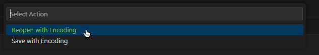

# How to fix missing characters in a TXT or SRT file.
Let's presume someone gave you a `.txt` or `.srt` file, however, some characters are missing:
```txt
Jeden z mojich klientov
m� zlo�ineck� sie� v Mattancherry.

So zlo�incami to nep�jde.
```
or they are malformed:
```txt
Nie, h¾adajte.

- Èo sa stalo?
- Niè.
```
This can often happen with `.txt` or `.srt` files when they're saved with the incorrect/non-standard encoding.  
Most text or text-like files are nowadays saved in an encoding called `utf-8`.
Fear not! this can be fixed!

## Open the file in VSCode
If you don't have VSCode installed, You can quickly install it here:  
https://code.visualstudio.com/download  
However, there are alternative solutions that doesen't require installing VSCode below.  

1. Open the file - either by first opening VSCode and hitting `Ctrl` + `O` (or using `File` > `Open File...`)
2. Click the encoding button in status bar:  

3. Select `Reopen with Encoding`  

4. Pick an encoding - For Slovak and Eastern European languages, i've had the best luck with `Windows 1250` or `Windows 1252`. 
5. If there are still characters missing/malformed, repeat the last 2 steps, picking a different encoding
6. If you found a satisfactory encoding, you can click `Save with Encoding` and pick `UTF-8`.

## Open it in Word
If you have a copy of Microsoft Word, you can try this method.  
I tested it with Lifetime copy of MS Word 2016, older/never versions will likely work but look a bit different.  
When opening the file in word, I was presented with this dialog:  
  
Basically just pick an encoding that makes the preview look good, and `Save As`  

## Backup solution: Online subtitle fixer
You can upload your file here: https://subtitletools.com/convert-text-files-to-utf8-online  
It will try to automatically guess the encoding and convert to it.  
It's not perfect and sometimes removes some characters it can't guess. Some manual clean up might be requried.  