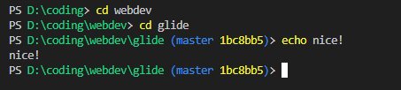

# Custom Windows PowerShell Prompt
Sick of all your cool friends using linux having nice terminal prompts, while you're still using windows?  
While you could install something like [oh-my-posh](https://ohmyposh.dev) or [starship](https://starship.rs), i find both of these slow just because of how much underlying work they're doing.
  
Writing a your own PowerShell prompt is pretty simple!

## Prerequisites
To get this nice prompt in VSCode, you should put the following into `settings.json`;
```jsonc
"terminal.integrated.shellIntegration.enabled": true,
"terminal.integrated.defaultProfile.windows": "PowerShell"
```  
Some other settings i'd also recommend:
```jsonc
// one of these: fileDirname is the currently open file
// workspaceRoot is the workspace

// "terminal.integrated.cwd": "${fileDirname}",
"terminal.integrated.cwd": "${workspaceRoot}",

"terminal.integrated.profiles.windows": {
	"PowerShell": {
		"source": "PowerShell",
		"args": [
			"-ExecutionPolicy",
			"Bypass", // this allows certain commands that otherwise don't work
			"-nologo" // this hides the "Windows PowerShell" banner with version
		],
	}
},
```

## Writing the prompt
1. In PowerShell, type `$profile`
2. Open that file in an editor
   - in VSCode you can alt-click it
   - if you have VSCode but are not in it right now, just type `code $profile`
3. Configure your prompt! Here's mine:

```ps1
function prompt {
	[Console]::TreatControlCAsInput = $True # block ctrl+c from killing this whle it runs
	# get both branch name and commit hash before writing anything to not have delayed output
	$gitBranch = & git rev-parse --abbrev-ref HEAD 2>$null
	$commitHash = & git rev-parse --short HEAD 2>$null

	Write-Host "PS" -NoNewLine
	Write-Host " $PWD" -NoNewLine -ForegroundColor "green"
	if ($gitBranch) {
		Write-Host " ($gitBranch" -NoNewLine -ForegroundColor "blue" 
		if ($commitHash) {
			Write-Host " " -NoNewLine
			Write-Host "$commitHash" -NoNewLine -foregroundColor "yellow"
		}
		Write-Host ")" -NoNewLine -ForegroundColor "blue"
	}
	[Console]::TreatControlCAsInput = $False # enable ctrl+c again
	$userPrompt = "> "
	return $userPrompt
}
```
Which results in:


## Prompt-writing tips:
- take a look at [various examples in this StackOverflow post](https://stackoverflow.com/questions/1287718/how-can-i-display-my-current-git-branch-name-in-my-powershell-prompt). Most of them are overly complicated, but you'll get an idea what you can do even if you haven't written any powershell code before
- disable ctrl+c to kill the prompt function with `[Console]::TreatControlCAsInput`
- use `Write-Host "" -NoNewLine` to write to the current prompt's line
- use `Write-Host "" -ForegroundColor` or `-BackgroundColor` to set the color
  - the allowed values are: `Black, DarkBlue, DarkGreen, DarkCyan, DarkRed, DarkMagenta, DarkYellow, Gray, DarkGray, Blue, Green, Cyan, Red, Magenta, Yellow, White`
- Have Fun!